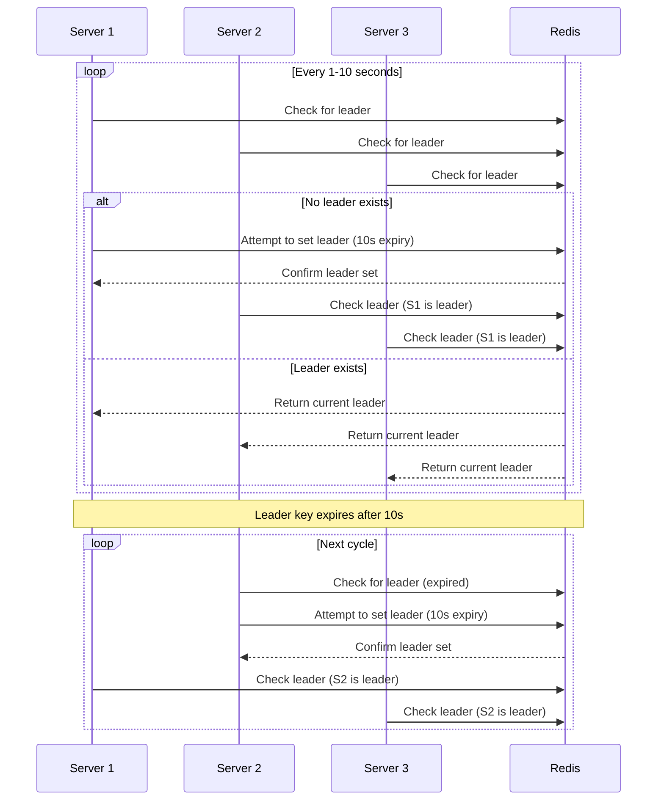

# leader-election

This project simulate a basic leader election process in a distributed system. Multiple server instances run concurrently, each trying to claim leadership by setting a key in a shared Redis database. The system ensures that only one server is recognized as the leader at any given time.

# Setup

Build and run the containers:

```sh
docker-compose up --build
```

Start the services using Docker Compose, this command will start Redis and three server instances.

```sh
docker-compose up
```

To stop the services, press <kbd>⌃ Control</kbd> + <kbd>C</kbd>.

# API Endpoints

Each server exposes a single HTTP endpoint that returns the current leader's ID.

Example usage:

```sh
curl http://localhost:8001/
```

Response:

```json
{ "leader": "service8001" }
```

# Data flow


